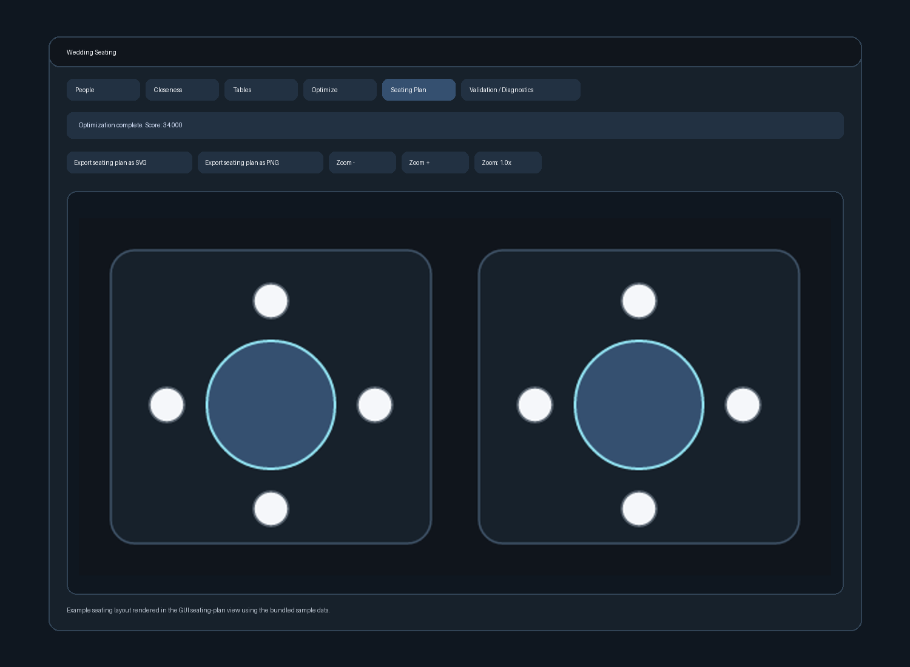

# wedding-seating-optimizer

Rust workspace for wedding seating optimization:

- `crates/seating-core`: models, parsing, validation, scoring, optimization, tests.
- `crates/seating-cli`: clap-based CLI (`validate`, `optimize`, `score`, `render`).
- `crates/seating-gui`: native iced GUI with structured editors for people, closeness rules, tables, optimization, seating-plan rendering, and CSV/JSON import/export.

## CLI quick start

```bash
cargo run -p seating-cli -- validate --people people.csv --closeness closeness.csv --tables tables.json
cargo run -p seating-cli -- optimize --people people.csv --closeness closeness.csv --tables tables.json --output seating.csv --seed 1234 --solutions 1
cargo run -p seating-cli -- score --people people.csv --closeness closeness.csv --tables tables.json --seating seating.csv
cargo run -p seating-cli -- render --people people.csv --tables tables.json --seating seating.csv --output seating-plan.svg
```

## GUI

```bash
cargo run -p seating-gui
```

The GUI now edits typed project data through structured tabs and renders the seating plan directly in the app.


